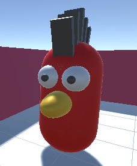

Klik met de rechtermuisknop in het Hierarchy venster en selecteer **Create Empty** 3D-object en geef het nieuwe GameObject een logische naam.

Klik met de rechtermuisknop op je nieuwe 3D-vorm en voeg andere 3D-vormen toe vanuit **Create** > **3D Object** als onderliggende game objects. De onderliggende objecten bewegen mee met het eerste 3D-vorm GameObject.

Breng je vormen tot leven door materialen uit het projectvenster naar de vorm in de scèneweergave te slepen.

Deze NPC heeft een capsulelichaam met onderliggende GameObjects die bollen, een capsule en gedraaide kubussen zijn. De vormen zijn hernoemd om het deel van de NPC dat ze vertegenwoordigen weer te geven en gekleurd met materialen.

